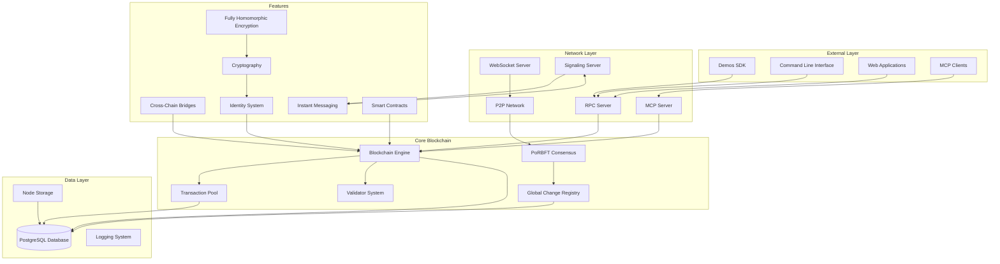

# Demos Network Node - Onboarding Documentation

## Project Overview

The Demos Network is a comprehensive blockchain network implementation that provides:

- **Blockchain Network Infrastructure**: A complete blockchain node implementation with custom consensus mechanisms, transaction processing, and state management
- **Cross-Chain Bridge Platform**: Multi-chain interoperability supporting various blockchain networks through bridges and asset wrapping
- **Decentralized Communication System**: Peer-to-peer messaging, instant messaging protocol, and signaling server capabilities
- **Smart Contract Platform**: EVM-compatible smart contract execution with multichain support
- **Developer Tools & APIs**: RPC endpoints, MCP (Model Context Protocol) server, and comprehensive SDK integration

The project solves the problem of blockchain interoperability, scalability, and developer accessibility by providing a unified platform that connects different blockchain networks while maintaining security and decentralization.

## Core Architecture

### Main Architectural Pattern

The system follows a **hybrid microservices-monolith architecture** with:

- **Modular Core**: Single node application with feature-based modular organization
- **Event-Driven Communication**: Asynchronous message passing between components
- **Plugin Architecture**: Extensible feature system for bridges, consensus mechanisms, and protocols
- **Database Layer**: PostgreSQL for persistent storage with TypeORM abstraction

### Component Interactions

The main components interact through:

- **Shared State Management**: Global state accessible across all modules
- **Event Broadcasting**: Consensus events, peer discovery, and transaction propagation
- **RPC Communication**: RESTful API endpoints for external communication
- **WebSocket Connections**: Real-time peer-to-peer communication
- **Database Transactions**: Atomic operations for blockchain state updates

### Architecture Diagram



## Key Components & Their Responsibilities

### Core Blockchain Components

#### `/src/libs/blockchain/`

- **`chain.ts`**: Main blockchain engine managing blocks, transactions, and state
- **`block.ts`**: Block structure and validation logic
- **`transaction.ts`**: Transaction processing and validation
- **`mempool_v2.ts`**: Transaction pool management and ordering
- **`gcr/`**: Global Change Registry for tracking state changes

#### `/src/libs/consensus/v2/`

- **`PoRBFT.ts`**: Proof of Random Byzantine Fault Tolerance consensus implementation
- **`secretaryManager.ts`**: Coordinator node management for consensus rounds
- **`shardManager.ts`**: Shard-based consensus coordination

### Network & Communication

#### `/src/libs/network/`

- **`server_rpc.ts`**: Main RPC server handling HTTP/WebSocket requests
- **`bunServer.ts`**: Fast HTTP server implementation using Bun runtime
- **`endpointHandlers.ts`**: Request routing and response handling
- **`manageP2P.ts`**: Peer-to-peer network management

#### `/src/libs/peer/`

- **`PeerManager.ts`**: Peer discovery, connection management, and authentication
- **`Peer.ts`**: Individual peer connection handling and communication

### Cross-Chain Features

#### `/src/features/bridges/`

- **`rubic.ts`**: Integration with Rubic SDK for cross-chain swaps
- **`bridges.ts`**: Bridge orchestration and management
- **`bridgeUtils.ts`**: Common bridge utilities and token mappings

#### `/src/features/multichain/`

- **`XMDispatcher.ts`**: Cross-chain message dispatching
- **`assetWrapping.ts`**: Token wrapping and unwrapping logic
- **`routines/executors/`**: Transaction execution on different chains

### Advanced Features

#### `/src/features/InstantMessagingProtocol/`

- **`signalingServer.ts`**: WebSocket signaling server for peer discovery
- **`ImPeers.ts`**: Instant messaging peer management

#### `/src/features/mcp/`

- **`MCPServer.ts`**: Model Context Protocol server for AI integration
- **`demosTools.ts`**: MCP tools for blockchain operations

#### `/src/features/postQuantumCryptography/`

- **`PoC.ts`**: Post-quantum cryptography implementation
- **`enigma_lite.ts`**: Lightweight encryption utilities

### Data & Storage

#### `/src/model/entities/`

- **`Blocks.ts`**: Block entity definition
- **`Transactions.ts`**: Transaction entity definition
- **`GCRv2/`**: Global Change Registry v2 entities
- **`Validators.ts`**: Validator information storage

#### `/src/utilities/`

- **`logger.ts`**: Comprehensive logging system
- **`sharedState.ts`**: Global state management
- **`mainLoop.ts`**: Main application event loop

## Getting Started

### Prerequisites

- **Node.js**: 20.x or later
- **Bun**: Latest stable version
- **Docker**: Latest stable version with Docker Compose
- **PostgreSQL**: Managed via Docker

### Installation

1. **Clone the repository**

    ```bash
    git clone <repository-url>
    cd node
    ```

2. **Install dependencies**

    ```bash
    bun install
    ```

3. **Generate identity (if needed)**

    ```bash
    bun run keygen
    ```

4. **Configure environment**

    ```bash
    cp env.example .env
    cp demos_peerlist.json.example demos_peerlist.json
    ```

5. **Edit configuration files**
    - Update `.env` with your `EXPOSED_URL` and other settings
    - Configure `demos_peerlist.json` with known peers

### Running the Application

#### Development Mode

```bash
# Start database and node
./run

# Or with custom ports
./run -p 53551 -d 5333

# Clean database and start
./run -c
```

#### Production Mode

```bash
# Start with production configuration
bun run start

# Start with automatic updates
bun run start:up
```

### Running Tests

```bash
# Run blockchain tests
bun run test:chains

# Run specific test file
bun test src/tests/transactionTester.ts
```

### Additional Commands

```bash
# Update SDK to latest version
bun run upgrade_sdk

# Run database migrations
bun run migration:run

# Check node balance
bun run dump_balance

# Format code
bun run format

# Lint code
bun run lint
```

## Data Flow

### Transaction Processing Flow

1. **Transaction Submission**
    - Client submits transaction via RPC endpoint
    - Transaction validated for format and signature
    - Added to mempool for processing

2. **Consensus Processing**
    - PoRBFT consensus algorithm selects validator shard
    - Transactions ordered and bundled into blocks
    - Secretary node coordinates consensus rounds

3. **Block Creation & Validation**
    - Block created with ordered transactions
    - Block validated by shard validators
    - Consensus reached on block validity

4. **State Updates**
    - Successful transactions applied to Global Change Registry (GCR)
    - Database updated with new block and state changes
    - Failed transactions rolled back

5. **Network Propagation**
    - New block broadcasted to all network peers
    - Peer synchronization ensures network consistency

### Cross-Chain Bridge Flow

1. **Bridge Request**
    - User initiates cross-chain transaction
    - Rubic SDK provides quote and swap data
    - Transaction submitted to source chain

2. **Asset Locking**
    - Source chain assets locked in bridge contract
    - Bridge event recorded in GCR
    - Cross-chain message created

3. **Message Relay**
    - XMDispatcher handles cross-chain messaging
    - Target chain receives and validates message
    - Asset minting/unlocking on target chain

4. **Confirmation**
    - Target chain transaction confirmed
    - Bridge completion recorded in GCR
    - User receives assets on target chain

### Key Data Structures

#### Transaction Structure

```typescript
interface Transaction {
    hash: string
    from: string
    to: string
    amount: string
    fee: string
    nonce: number
    signature: Uint8Array
    timestamp: number
    data?: any
}
```

#### Block Structure

```typescript
interface Block {
    number: number
    hash: string
    previousHash: string
    timestamp: number
    transactions: Transaction[]
    validator: string
    signature: Uint8Array
}
```

#### Global Change Registry (GCR)

The GCR tracks all state changes with cryptographic references to source transactions:

- Account balances
- Token holdings
- Smart contract state
- Bridge operations
- Identity registrations

### Database Schema

The system uses PostgreSQL with TypeORM for data persistence:

- **`blocks`**: Blockchain blocks with transaction references
- **`transactions`**: Individual transaction records
- **`gcr_main`**: Global Change Registry entries
- **`gcr_hashes`**: GCR state hashes for verification
- **`validators`**: Network validator information
- **`mempool`**: Pending transaction pool

All data flows are designed to maintain blockchain immutability while enabling efficient querying and state management through the GCR system.
