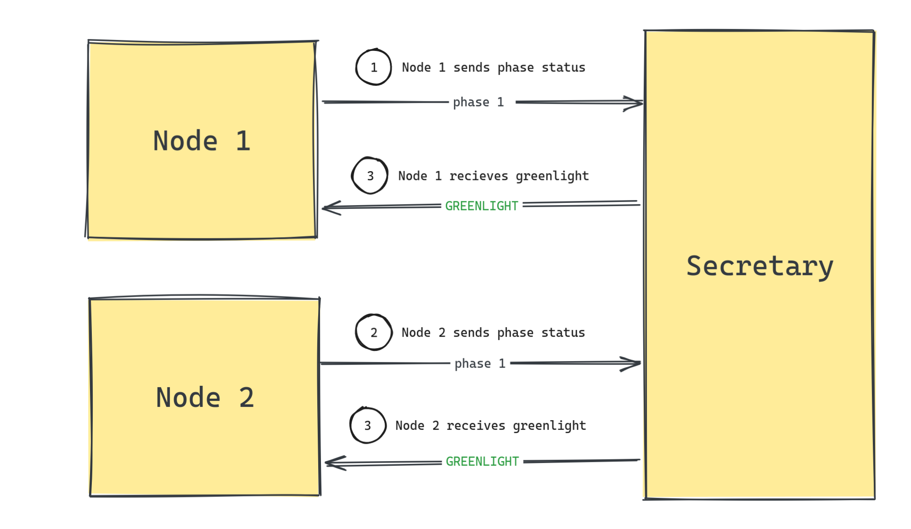

## The Secretary System

In a consensus round, the first node of the shard is chosen to be the Secretary. The secretary node is responsible for ensuring that all nodes are in sync during each phase of the consensus.

At the beginning of the consensus round, the secretary will start the "Secretary Routine", which is a while loop that will run until the consensus is over. Inside the while loop, the secretary will wait for the other nodes to submit their phase completion status. After all nodes have submitted their status for a given phase, the secretary will send each node (including itself) a greenlight to proceed to the next phase.

## The Secretary Manager Class

The `SecretaryManager` class is a singleton that manages the consensus routine for all nodes during a consensus round.

If a node is the secretary, the `SecretaryManager` class will oversee the secretary routine and sending greenlights. If not, it will only used to wait for the greenlight from the secretary.

To understand how the `SecretaryManager` class works, please follow the following modules:

0. `SecretaryManager.secretaryRoutine`: Starts the secretary routine.
1. PoRBFT.ts > `updateValidatorPhase`: Called by a node after it has cleared a phase.
2. `manageConsensusRoutines.ts`
    - "setValidatorPhase" handler: How the secretary receives a validator phase from a node.
    - "greenlight" handler: How a node receives a greenlight from the secretary.

> !TIP
> See `@/libs/consensus/v2/types/shardTypes.ts` and `@/libs/consensus/v2/types/validationStatusTypes.ts` for the shard and validation phase types.

## The Secretary Routine

The secretary routine is a while loop that runs until the consensus ends. The secretary routine runs as follows:

1. Register a waiter for a `SET_WAIT_STATUS` event.
2. `await` for the `SET_WAIT_STATUS` event to be resolved.
    1. If the `SET_WAIT_STATUS` event is resolved, restart the loop.
    2. If the `SET_WAIT_STATUS` event times out, then check if some nodes are offline, and release the waiting members (send a greenlight).

The wait mechanism is implemented using the `Waiter` class, which uses Javascript promises and timeouts to wait for events.

When a node submits their phase status, we check if that was the last node required to resolve the `SET_WAIT_STATUS` event. If so, we resolve the `SET_WAIT_STATUS` event and send a greenlight to all nodes (outside the secretary routine while loop).

## The Greenlight Routine

When a node clears a phase, it will do the following:

1. Update the node's local phase status.
2. Send its phase status to the secretary.
3. Register a waiter for a `GREEN_LIGHT` event.
4. `await` for the `GREEN_LIGHT` event to be resolved.
    1. If the `GREEN_LIGHT` event is resolved, then the node will proceed to the next phase.
    2. If the `GREEN_LIGHT` event times out, handle the secretary being offline.

### NOTES

1. The greenlight waiter resolves with the secretary block timestamp which is used to forge the current block.
2. The request to send the phase status to the secretary also returns the secretary block timestamp, along with the greenlight flag. If the greenlight flag is true, then the node will resolve the greenlight waiter and proceed to the next phase.

## When the Secretary goes down

When the secretary goes down, the greenlight waiters will timeout and the second node will be promoted to the secretary role.

The new secretary will pull the other nodes' phases and take over the secretary routine.

## When a node goes down

When a node goes down, the secretary will timeout waiting for `SET_WAIT_STATUS`. The secretary will then ping the node to check if it's still online.

1. If the node is still online, the secretar will do nothing.
2. If the node is offline, the secretary will remove the node from the shard and out of the consensus.
