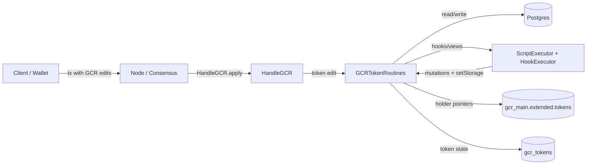
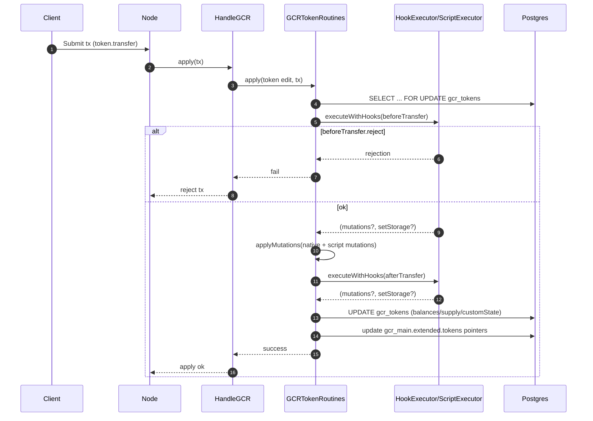
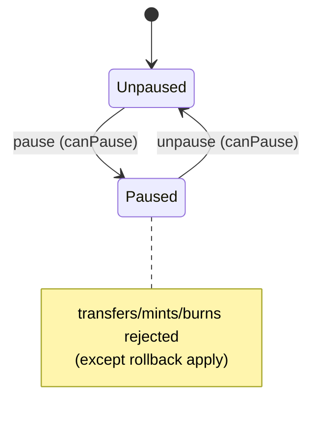

# Token System (Demos Node)

This document explains the **native fungible token system** implemented in this node, including:

- Storage model (DB/GCR)
- Native operations (create/transfer/mint/burn/pause/ACL/script upgrade/ownership transfer)
- Read RPC APIs (`token.*`)
- Token scripting (hooks + views, execution model, determinism constraints)

It also includes diagrams (Mermaid) to make the flow easier to understand.

---

## 1) Storage model

### 1.1 Primary source of truth: `gcr_tokens` (`GCRToken`)

Tokens are stored in Postgres as rows in `gcr_tokens`. The ORM entity is `src/model/entities/GCRv2/GCR_Token.ts`.

Core fields:

- **Identity**
  - `address`: token address (derived from deployer + nonce + hash)
  - `deployer`, `deployerNonce`, `deployTxHash`, `deployedAt`
- **Metadata**
  - `name`, `ticker`, `decimals`
  - `hasScript` (boolean)
- **State**
  - `totalSupply` (string, bigint-like)
  - `balances` (`jsonb`: address → string amount)
  - `allowances` (`jsonb`: owner → spender → string amount) *(present in schema; native approve/transferFrom are not currently implemented as first-class operations)*
  - `customState` (`jsonb`: arbitrary object used by scripts)
- **Access control**
  - `owner` (address)
  - `paused` (boolean)
  - `aclEntries` (`jsonb`: list of `{ address, permissions[], grantedAt, grantedBy }`)
- **Script**
  - `script` (`jsonb`: `TokenScript` with code + ABI-like method metadata)
  - `scriptVersion`, `lastScriptUpdate`

### 1.2 Holder pointers: `GCRMain.extended.tokens`

For UX-friendly token discovery, each holder also has lightweight “token pointers” stored on their `GCRMain` record:

- `GCRMain.extended.tokens[]` contains `{ tokenAddress, ticker, name, decimals, firstAcquiredAt, lastUpdatedAt }`
- `GCRTokenRoutines` adds/removes these pointers when balances move from/to zero.

---

## 2) Native operations (write path)

Native token operations are represented as **GCR edits** of type `"token"` (see `src/libs/blockchain/gcr/types/token/GCREditToken.ts`), and are applied by:

- `src/libs/blockchain/gcr/handleGCR.ts` (`HandleGCR.apply`)
- `src/libs/blockchain/gcr/gcr_routines/GCRTokenRoutines.ts` (`GCRTokenRoutines.apply`)

Operations:

- `create`: create a new token row + initial balances/ACL
- `transfer`: move balances and update holder pointers
- `mint`: increase `totalSupply` and recipient balance (permission-gated)
- `burn`: decrease `totalSupply` and burn-from balance (permission-gated when burning others)
- `pause` / `unpause`: toggles `paused` (permission-gated)
- `updateACL` / `grantPermission` / `revokePermission`: manage ACL entries (permission-gated)
- `upgradeScript`: replace script code and metadata (permission-gated)
- `transferOwnership`: set new owner (permission-gated)
- `custom`: invoke a script-defined write method (Phase 5.2; see “Custom methods” notes in §4.4)

### 2.1 Permissions (ACL)

Permissions are string-literals defined in `src/libs/blockchain/gcr/types/token/TokenPermissions.ts`:

- `canMint`, `canBurn`, `canUpgrade`, `canPause`, `canTransferOwnership`, `canModifyACL`, `canExecuteScript`

Rules of thumb:

- **Owner** implicitly has all permissions.
- Other addresses must appear in `aclEntries` with the relevant permission(s).

### 2.2 Pause semantics

When `paused = true`, operations like `transfer/mint/burn` are rejected (except when the routine is applying a rollback).

---

## 3) Read RPC APIs (`token.*`)

Node calls are handled in `src/libs/network/manageNodeCall.ts`.

### 3.1 “Committed” vs “live”

Many read APIs have a `*Committed` variant. During sync/consensus apply, the node can reject committed reads with:

- HTTP-like code `409`
- error `"STATE_IN_FLUX"`

This is guarded by an `inGcrApply` flag and a watchdog timeout (`COMMITTED_READ_IN_FLUX_MAX_MS`).

### 3.2 Available endpoints

- `token.get` / `token.getCommitted`
  - Returns metadata, full state (`totalSupply/balances/allowances/customState`), and ACL.
- `token.getBalance` / `token.getBalanceCommitted`
  - Returns balance for one address.
- `token.getHolderPointers`
  - Returns `GCRMain.extended.tokens` for an address.
- `token.callView` / `token.callViewCommitted`
  - Executes a **script view** method (`module.exports.views[name]`) and returns `{ value, executionTimeMs, gasUsed }`.

---

## 4) Token scripting

Token scripts are executed in-process using Node’s `vm` sandbox (`src/libs/scripting/index.ts`).

### 4.1 Script shape

A script is a CommonJS module:

- `module.exports.hooks`: `{ beforeTransfer, afterTransfer, beforeMint, afterMint, beforeBurn, afterBurn, ... }`
- `module.exports.views`: pure read methods callable via `token.callView`
- `module.exports.methods`: custom write methods (see §4.4)

### 4.2 Hook execution model (transfer/mint/burn)

When a scripted token receives a native operation, the node:

1. Builds `tokenData` from the DB entity (`GCRTokenRoutines.tokenToGCRTokenData`)
2. Creates the **native mutations** (transfer/mint/burn) unless it is a self-transfer
3. Executes `before*` hook (if present)
   - can `reject`
   - can replace `mutations`
   - can `setStorage` (writes to `customState`)
4. Applies mutations to balances/supply
5. Executes `after*` hook (if present)
   - can `reject` (after mutations)
   - can apply additional mutations
   - can `setStorage`

Important invariant:

- **Self-transfer is a no-op** in the native mutation layer (prevents accidental minting). Scripts can still implement special self-transfer behavior by returning explicit mutations.

### 4.3 Hook context (`ctx`) and determinism

The hook context object passed to scripts contains:

```ts
{
  operation: "transfer" | "mint" | "burn"
  operationData: { ... }           // e.g. { from, to, amount }
  tokenAddress: string
  token: tokenData                // balances/totalSupply/customState (as BigInts + objects)
  txContext: {
    caller: string
    txHash: string
    timestamp: number
    blockHeight: number
    prevBlockHash: string
  }
  mutations: TokenMutation[]      // current mutation list
}
```

Determinism expectations:

- Hooks must behave deterministically across all validators given the same `(token state, operationData, txContext)`.
- Avoid non-deterministic sources (system time, randomness, I/O). Use `ctx.txContext.timestamp` rather than `Date.now()`.

Notes on current implementation details:

- `prevBlockHash` is currently passed as an empty string in token hook requests from `GCRTokenRoutines`.
- `blockHeight` is taken from `tx.blockNumber` (or `0` if missing).
- `timestamp` is `tx.content.timestamp` or `Date.now()` as fallback in some paths.
- Script execution is time-bounded in the VM to reduce risk of a malicious/buggy infinite loop blocking RPC or consensus/sync apply. Defaults can be overridden via env:
  - `TOKEN_SCRIPT_COMPILE_TIMEOUT_MS`
  - `TOKEN_SCRIPT_VIEW_TIMEOUT_MS`
  - `TOKEN_SCRIPT_HOOK_TIMEOUT_MS`
  - `TOKEN_SCRIPT_METHOD_TIMEOUT_MS`
  - `TOKEN_SCRIPT_ASYNC_TIMEOUT_MS` (best-effort for thenables; cannot preempt a CPU-bound loop after an `await`)

### 4.4 Custom methods (Phase 5.2 / WIP)

`GCRTokenRoutines` supports a `"custom"` token operation meant to invoke `module.exports.methods[method]` for scripted tokens.

This path now passes `scriptCode` to `scriptExecutor.executeMethod`, so custom method dispatch works as intended (subject to the limitations below).

Current limitations:
- Rollbacks for `"custom"` are intentionally skipped (script state is opaque unless we log/replay mutations).
- `executeMethod` currently returns no mutations (hook-based mutations are for transfer/mint/burn; custom-method mutation plumbing can be added later).

---

## 5) Diagrams

### 5.1 High-level component flow



### 5.2 Transfer with hooks (sequence)



### 5.3 Token pause state (simplified)



---

## 6) Practical verification

The maintained end-to-end verification surface now lives under `testing/`. Use `bun run testenv:tokens:local -- --build-first` for the token-core suite, and inspect `testing/runs/_latest/` for generated summaries.
