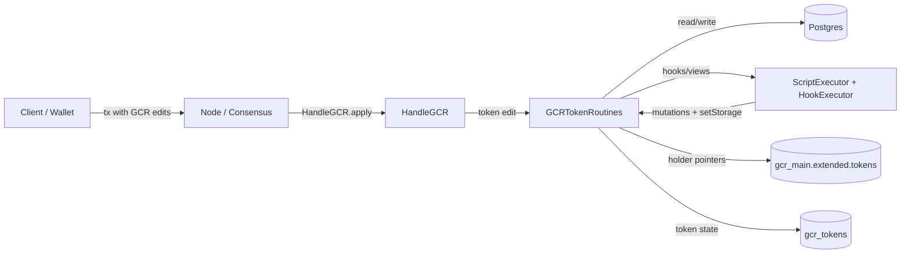
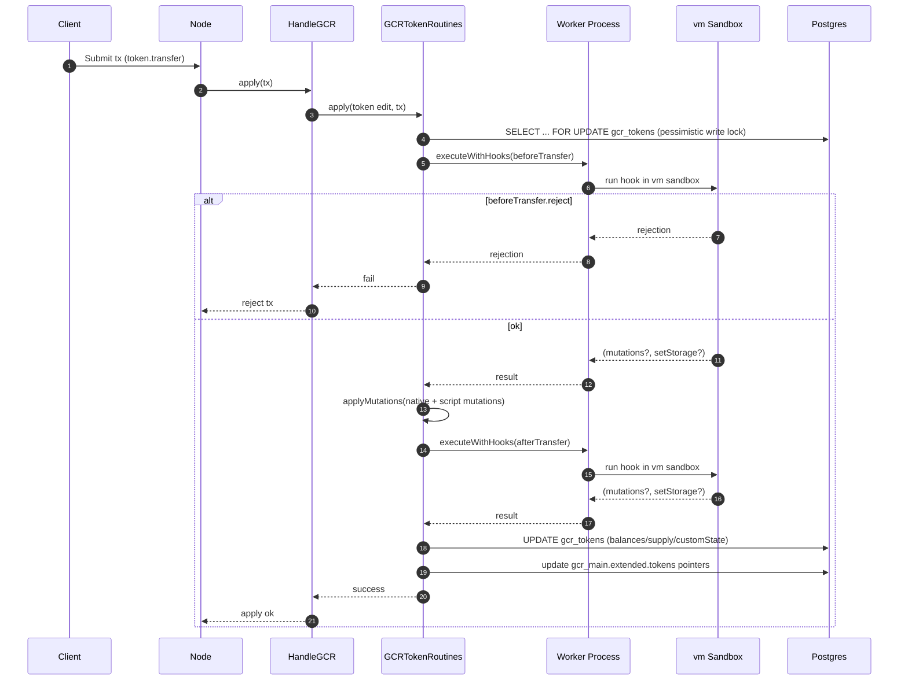
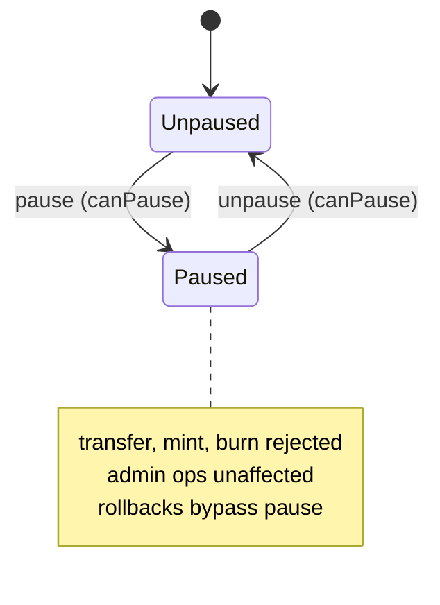

# Token System (Demos Node)

This document describes the native fungible token system implemented in the Demos node:

- Storage model (DB entity and holder pointers)
- Native operations (create, transfer, mint, burn, pause, ACL, script upgrade, ownership transfer)
- Read RPC APIs (`token.*`)
- Token scripting (architecture, hooks, views, custom methods)
- Diagrams
- Practical verification

---

## 1. Storage model

Token data is split across two storage locations in the Demos node: a primary `gcr_tokens` table that holds the full token record, and lightweight holder pointers stored in each account's `GCRExtended.tokens` array.

---

### 1.1 The `GCRToken` entity (`gcr_tokens` table)

Source: `src/model/entities/GCRv2/GCR_Token.ts`

Each row in `gcr_tokens` represents one deployed fungible token. The entity is indexed on `deployer` and `ticker`.

#### Identity

| Field | Type | Description |
|---|---|---|
| `address` | `text` (PK) | Token address. Derived as `sha256(deployer + nonce + hash(tokenObject))`. |
| `deployTxHash` | `text` | Hash of the transaction that deployed this token. |

#### Metadata (immutable after creation)

| Field | Type | Description |
|---|---|---|
| `name` | `text` | Human-readable token name. |
| `ticker` | `text` | Token ticker symbol. |
| `decimals` | `integer` | Number of decimal places. |
| `deployer` | `text` | Address of the account that deployed the token. |
| `deployerNonce` | `integer` | Deployer's nonce at deployment time. |
| `deployedAt` | `bigint` | Block timestamp at deployment (Unix timestamp). |
| `hasScript` | `boolean` | Whether a `TokenScript` is attached to this token. |

#### Supply and balances

| Field | Type | Description |
|---|---|---|
| `totalSupply` | `text` | Total circulating supply as a string-encoded bigint. |
| `balances` | `jsonb` | Map of `address → balance`. Each balance is a string-encoded bigint. Shape: `Record<string, string>`. |
| `allowances` | `jsonb` | Nested map of `owner → spender → amount`. Each amount is a string-encoded bigint. Shape: `Record<string, Record<string, string>>`. |
| `customState` | `jsonb` | Arbitrary key-value state available to scripted tokens. Shape: `Record<string, unknown>`. Defaults to `{}`. |

#### Access control

| Field | Type | Description |
|---|---|---|
| `owner` | `text` | Address of the token owner. The owner always holds all permissions. |
| `paused` | `boolean` | When `true`, transfers and other state-mutating operations are halted. Defaults to `false`. |
| `aclEntries` | `jsonb` | Array of ACL entries granting per-address permissions. See structure below. Defaults to `[]`. |

Each element of `aclEntries` has this shape:

```ts
{
  address:     string    // address receiving the grant
  permissions: string[]  // list of TokenPermission values
  grantedAt:   number    // Unix timestamp when the grant was issued
  grantedBy:   string    // address that issued the grant
}
```

#### Scripting

| Field | Type | Description |
|---|---|---|
| `script` | `jsonb` (nullable) | The attached `TokenScript`, or `null` if `hasScript` is `false`. See structure below. |
| `scriptVersion` | `integer` | Monotonically increasing counter incremented on each script upgrade. Defaults to `0`. |
| `lastScriptUpdate` | `bigint` (nullable) | Block timestamp of the most recent script upgrade, or `null` if never upgraded. |

The `TokenScript` object (defined in `src/libs/blockchain/gcr/types/token/TokenTypes.ts`) has this shape:

```ts
{
  version:    number               // script format version
  code:       string               // executable script source
  methods:    TokenScriptMethod[]  // callable method descriptors
  hooks:      TokenHookType[]      // lifecycle hooks this script subscribes to
  codeHash:   string               // hash of code, used for integrity checks
  upgradedAt: number               // block timestamp of the last upgrade
}
```

Each `TokenScriptMethod` descriptor:

```ts
{
  name:     string                                // method name
  params:   Array<{ name: string; type: string }> // parameter list
  returns?: string                                // return type, if any
  mutates:  boolean                               // whether the method modifies state
}
```

Available `TokenHookType` values: `beforeTransfer`, `afterTransfer`, `beforeMint`, `afterMint`, `beforeBurn`, `afterBurn`, `onApprove`.

#### Timestamps

| Field | Type | Description |
|---|---|---|
| `createdAt` | `timestamp` (`CreateDateColumn`) | Row insertion time, managed automatically by TypeORM. |
| `updatedAt` | `timestamp` (`UpdateDateColumn`) | Row last-modification time, managed automatically by TypeORM. |

---

### 1.2 Holder pointers (`GCRExtended.tokens`)

Source: `src/libs/blockchain/gcr/types/token/TokenTypes.ts` — `TokenHolderReference`

When an account's balance in a given token rises above zero, a `TokenHolderReference` is added to that account's `GCRExtended.tokens` array. When the balance falls back to zero, the pointer is removed. This keeps holder discovery O(1) per account without duplicating the full token record.

Each pointer contains only the fields needed for enumeration and display:

```ts
interface TokenHolderReference {
  tokenAddress: string  // address of the GCRToken record
  ticker:       string  // token ticker symbol
  name:         string  // human-readable token name
  decimals:     number  // decimal places (needed for display formatting)
}
```

The pointer carries no balance, supply, ACL, or script data. All authoritative state lives in the `gcr_tokens` row addressed by `tokenAddress`.

---

## 2. Native operations

Native operations are the built-in state transitions the token system supports — no script required. They are processed through `GCRTokenRoutines.apply()` in `src/libs/blockchain/gcr/gcr_routines/GCRTokenRoutines.ts`, which routes each `GCREditToken` to the appropriate handler.

Balance-mutating operations (`transfer`, `mint`, `burn`, `custom`) run inside a TypeORM transaction with `lock: { mode: "pessimistic_write" }`, preventing lost-update races during concurrent block-sync. Admin operations (`pause`, `unpause`, ACL changes, `upgradeScript`, `transferOwnership`) use a plain read-then-save without an explicit transaction or lock.

### 2.1 Operation reference

| Operation | Required Permission | Pause-blocked? | Rollback support |
|---|---|---|---|
| `create` | None (deployer only) | No | N/A |
| `transfer` | None | Yes | Yes — direction swaps (`from`/`to` reversed) |
| `mint` | `canMint` | Yes | Yes — reverses to deduction from `to` |
| `burn` | `canBurn` (only when burning another address's tokens) | Yes | Yes — reverses to credit to `from` |
| `pause` | `canPause` | No | Yes — sets `paused = false` |
| `unpause` | `canPause` | No | Yes — sets `paused = true` |
| `updateACL` | `canModifyACL` | No | Yes — flips grant/revoke action |
| `grantPermission` | `canModifyACL` | No | Yes — revokes the granted permissions |
| `revokePermission` | `canModifyACL` | No | Yes — re-grants the revoked permissions |
| `upgradeScript` | `canUpgrade` | No | Yes — restores previous script version |
| `transferOwnership` | `canTransferOwnership` | No | Yes — restores `previousOwner` |
| `custom` | Script checks `mutates` flag | No | No — returns `success: false` |

> **Self-transfer note:** Self-transfers (`from === to`) produce an empty native mutations list, preventing double-crediting. Scripts can still return explicit mutations via hooks.

> **`approve` note:** `approve` is not yet implemented as a native operation, but the scripting layer recognizes it — `hookNameForOperation` maps it to the `onApprove` hook (see §4.4). The `allowances` field on the entity is present but unused by any native operation.

### 2.2 Pause semantics

Pausing a token sets `token.paused = true`. Only three operations check this flag and reject when set:

- `transfer`
- `mint`
- `burn`

All admin operations (`updateACL`, `grantPermission`, `revokePermission`, `upgradeScript`, `transferOwnership`, `custom`) proceed regardless of pause state. A paused token can still have its ACL modified, its script upgraded, or its ownership transferred.

Rollback paths bypass the pause check entirely — rollbacks are applied unconditionally to allow consensus reversion even on paused tokens.

### 2.3 Permission rules

All permission checks call `hasPermission(token.toAccessControl(), edit.account, permission)`.

- **Owner always has all permissions.** No ACL entry is needed. Any address that is `token.owner` passes every permission check automatically.
- **Non-owner addresses require an explicit ACL entry** with the relevant permission string.
- **`transfer` has no permission gate.** Any caller can initiate a transfer; the only guard is sufficient balance on `data.from`.
- **`burn` has a conditional permission gate.** If `edit.account === data.from` (burning your own tokens), the `canBurn` check is skipped. `canBurn` is only required when burning tokens from a different address.
- **Both `pause` and `unpause` use the same `canPause` permission.**
- **Empty ACL means only the owner can perform protected operations.**

Available permissions:

| Permission string | What it gates |
|---|---|
| `canMint` | `mint` |
| `canBurn` | `burn` from another address |
| `canUpgrade` | `upgradeScript` |
| `canPause` | `pause`, `unpause` |
| `canTransferOwnership` | `transferOwnership` |
| `canModifyACL` | `updateACL`, `grantPermission`, `revokePermission` |
| `canExecuteScript` | Defined but **not currently checked** by the native `custom` handler. The only native gate is `methodDef.mutates`. Scripts may implement their own `canExecuteScript` checks. |

### 2.4 Rollback mechanics

Every `GCREditTokenBase` carries an `isRollback: boolean` flag. When `true`, the handler inverts the operation rather than applying it forward. Rollbacks skip all permission checks and pause checks.

- **`transfer`**: `data.from` and `data.to` are swapped. The same amount is moved in the opposite direction.
- **`mint`**: The minted amount is deducted from `data.to` and subtracted from `totalSupply`.
- **`burn`**: The burned amount is credited back to `data.from` and added back to `totalSupply`.
- **`upgradeScript`**: Restores `previousVersion`, `previousScript`, `previousHasScript`, and `previousLastScriptUpdate` from the edit's `data` fields. Falls back to clearing the script entirely if those fields are absent.
- **`transferOwnership`**: Sets `token.owner` back to `data.previousOwner`.
- **`updateACL` / `grantPermission` / `revokePermission`**: The grant/revoke action is flipped.
- **`pause`**: Sets `token.paused = false`.
- **`unpause`**: Sets `token.paused = true`.
- **`custom`**: Not supported. Returns `{ success: false, message: "Custom method rollback is unsupported without mutation logging" }`. Custom script state mutations are opaque to the native layer.

---

## 3. Read RPC APIs (`token.*`)

Token read endpoints are registered in `src/libs/network/handlers/tokenHandlers.ts`.

### 3.1 Committed vs live reads

Many read APIs have a `*Committed` variant. During sync or consensus apply, the node may refuse committed-read requests with:

- HTTP-like code `409`
- Error: `"STATE_IN_FLUX"`

This is guarded by an `inGcrApply` flag and a watchdog timeout (`COMMITTED_READ_IN_FLUX_MAX_MS`, default 120000ms). If the apply state has been stuck longer than this threshold, the node logs a warning but still returns the 409.

### 3.2 Available endpoints

| Endpoint | Description | Committed variant |
|---|---|---|
| `token.get` | Returns metadata, full state (`totalSupply`, `balances`, `allowances`, `customState`), and ACL. | `token.getCommitted` |
| `token.getBalance` | Returns balance for one address. | `token.getBalanceCommitted` |
| `token.getHolderPointers` | Returns `GCRExtended.tokens` (holder pointers, see §1.2) for an address. | None |
| `token.callView` | Executes a script view method (`module.exports.views[name]`) and returns `{ value, executionTimeMs, gasUsed }`. | `token.callViewCommitted` |

Additional query methods exist internally in `GCRTokenRoutines` (`getAllowance`, `getTokensOf`, `getTokensByDeployer`, `checkPermission`, `getPermissions`, `getACL`) but are not exposed as RPC endpoints.

---

## 4. Token scripting

### 4.1 Architecture

Script execution uses a two-layer isolation model: a **worker process** wrapping a **vm sandbox**.

**Worker process.** `ScriptWorkerClient` (in `src/libs/scripting/index.ts`) spawns a child process via Node's `spawn`, passing only a minimal, allowlisted environment: `PATH`, `HOME`, `NODE_ENV`, `TOKEN_SCRIPT_COMPILE_TIMEOUT_MS`, `TOKEN_SCRIPT_VIEW_TIMEOUT_MS`, `TOKEN_SCRIPT_HOOK_TIMEOUT_MS`, `TOKEN_SCRIPT_METHOD_TIMEOUT_MS`, and `TOKEN_SCRIPT_ASYNC_TIMEOUT_MS`. The sixth timeout variable, `TOKEN_SCRIPT_WORKER_GRACE_MS`, is only used by the parent process and is not forwarded to the worker.. All communication is line-delimited JSON over stdin/stdout. If the worker process exits unexpectedly or produces unparseable output, all in-flight requests fail immediately and the worker is restarted on the next request. A malicious or buggy script can crash or hang the worker without affecting the parent node process.

**vm sandbox.** Inside the worker, `vm-runtime.ts` compiles each script with `vm.createContext` and `vm.Script`. Immediately after context creation, a hardening script disables non-deterministic globals:

```ts
Date.now = () => { throw new Error("Date.now is disabled in token scripts") }
Math.random = () => { throw new Error("Math.random is disabled in token scripts") }
globalThis.process = undefined
globalThis.require = undefined
```

Code generation from strings is also disabled (`codeGeneration: { strings: false, wasm: false }`). The only non-standard global exposed to the script is `BigInt`.

### 4.2 Timeouts

Every request travels through two independent timeout layers: the vm hard-kill timeout (enforced by `vm.Script.runInContext`) and the worker-level wall-clock timeout (a `setTimeout` in `ScriptWorkerClient.request`). The worker-level timeout is the sum of all configured phase budgets plus a grace margin.

| Environment variable | Default | Applied to |
|---|---|---|
| `TOKEN_SCRIPT_COMPILE_TIMEOUT_MS` | 50 ms | vm compile + hardening phase |
| `TOKEN_SCRIPT_VIEW_TIMEOUT_MS` | 50 ms | Synchronous execution of a view function |
| `TOKEN_SCRIPT_HOOK_TIMEOUT_MS` | 50 ms | Synchronous execution of a hook function |
| `TOKEN_SCRIPT_METHOD_TIMEOUT_MS` | 50 ms | Synchronous execution of a custom method function |
| `TOKEN_SCRIPT_ASYNC_TIMEOUT_MS` | 2000 ms | `Promise.race` wrapper if the function returns a thenable |
| `TOKEN_SCRIPT_WORKER_GRACE_MS` | 250 ms | Added to every worker-level deadline |

The worker-level deadline for a given request kind is: `compile + <kind>_sync + async + grace`. If the deadline fires, the worker is killed with `SIGKILL` and the request rejects with a timeout error.

### 4.3 Script shape

A token script is a CommonJS module evaluated inside the sandbox. It assigns to `module.exports`:

```js
module.exports = {
  views: {
    myView(tokenData, ...args) { /* read-only, returns a value */ }
  },
  hooks: {
    beforeTransfer(ctx) { /* see §4.4 */ },
    afterTransfer(ctx)  { /* see §4.4 */ },
    beforeMint(ctx)     { },
    afterMint(ctx)      { },
    beforeBurn(ctx)     { },
    afterBurn(ctx)      { },
    onApprove(ctx)      { },  // approve has no after hook
  },
  methods: {
    myMethod(tokenData, ...args) { /* mutating, returns a value */ }
  }
}
```

`tokenData` passed to views and methods is a `GCRTokenData` snapshot built by `GCRTokenRoutines.tokenToGCRTokenData`: it contains `address`, `name`, `ticker`, `decimals`, `owner`, `totalSupply` (bigint), `balances` (map of address → bigint), `allowances` (nested map), `paused`, and `storage` (the token's `customState` field).

### 4.4 Hooks

Hooks fire around native operations (transfer, mint, burn, approve). The runtime resolves hook names with `hookNameForOperation`:

| Operation | Before hook | After hook |
|---|---|---|
| `transfer` | `beforeTransfer` | `afterTransfer` |
| `mint` | `beforeMint` | `afterMint` |
| `burn` | `beforeBurn` | `afterBurn` |
| `approve` | `onApprove` | _(none)_ |

**Hook context** (`ctx`) passed to every hook:

```ts
{
  operation:     string           // "transfer" | "mint" | "burn" | "approve"
  operationData: object           // e.g. { from, to, amount } for transfer
  tokenAddress:  string
  token:         GCRTokenData     // snapshot at time of hook invocation
  txContext: {
    caller:        string         // tx.content.from
    txHash:        string         // tx.hash
    timestamp:     number         // from tx.content.timestamp (throws if missing)
    blockHeight:   number         // tx.blockNumber ?? sharedState.lastBlockNumber
    prevBlockHash: string         // sharedState.lastBlockHash ?? "0".repeat(64)
  },
  mutations: TokenMutation[]      // native mutations accumulated so far
}
```

**Determinism guarantees:**

- `timestamp`: Read from `tx.content.timestamp`. If absent or non-finite, throws `new Error("Missing deterministic tx.content.timestamp")`. There is no `Date.now()` fallback.
- `blockHeight`: From `tx.blockNumber`. If absent, falls back to `sharedState.lastBlockNumber`. If neither resolves, throws `new Error("Unable to resolve deterministic block height from transaction or shared state")`.
- `prevBlockHash`: `sharedState.lastBlockHash ?? "0".repeat(64)` — never an empty string.

**Before-hook return value.** A before hook may return:

- `{ reject: string }` — aborts the operation with the given reason.
- `{ mutations: TokenMutation[] }` — replaces the accumulated mutation list.
- `{ setStorage: Record<string, unknown> }` — replaces `token.storage` before mutations are applied.
- `null` / `undefined` — no intervention.

After the before hook completes, `applyMutations(tokenData, mutations)` produces the intermediate state. For self-transfers, the native mutations list is empty (prevents double-crediting the same address); the balance maps are left unchanged. Scripts can still return explicit mutations for self-transfer behavior.

**After-hook return value.** Same contract as before hooks. Additional mutations are applied on top of the already-mutated state.

**Rejection.** Any thrown exception from a hook is caught and surfaced as a rejection. The transaction fails.

### 4.5 View methods

Views are invoked via `executeViewInSandbox`. The function is looked up in `compiled.views` and called with `(tokenData, ...args)`. If it returns a thenable, it is awaited under `TOKEN_SCRIPT_ASYNC_TIMEOUT_MS`. The return value is normalized through a bigint-safe JSON round-trip before being sent back across the worker boundary.

Views are read-only by convention — the call path never writes results back to the token entity.

### 4.6 Custom methods

Custom methods allow user-defined write operations via the `custom` GCR edit type. This feature is work in progress — see "Current status" below. Handled by `GCRTokenRoutines.handleCustomMethod`.

Before executing, the routine:

1. Looks up `methodDef` in `token.script.methods` by name.
2. Checks `methodDef.mutates === true`. View-only methods are rejected with `"Cannot invoke view method as transaction: <methodName>"`.
3. Builds a block context using the same deterministic helpers described in §4.4.
4. Calls `scriptExecutor.executeMethod`, which runs the function under `TOKEN_SCRIPT_METHOD_TIMEOUT_MS`.

`ScriptMethodResult` carries a `mutations` field. `GCRTokenRoutines` checks `result.mutations.length > 0` and applies them via `applyMutations` if present. The entire handler runs inside a pessimistic-write transaction on the token row.

**Current status:** `executeMethodInSandbox` always returns `mutations: []`. The mutation plumbing is fully wired but the sandbox does not yet produce mutations. The return value of the method function is passed back to the caller as `returnValue`.

**Rollback:** Not supported. Returns `{ success: false, message: "Custom method rollback is unsupported without mutation logging" }`.

---

## 5. Diagrams

### 5.1 High-level component flow



### 5.2 Transfer with hooks (sequence)



### 5.3 Token pause state



---

## 6. Practical verification

The end-to-end verification surface lives under `testing/`. Use `bun run testenv:tokens:local -- --build-first` (defined in `package.json`) to run the token core test suite — `--build-first` compiles the node before launching the test environment. Inspect `testing/runs/_latest/` for generated summaries.

### Notable test scenarios

- **`token_smoke`**: Basic sanity — create a token, mint, transfer, burn, pause/unpause, verify state consistency.

- **`token_mint_smoke`**, **`token_burn_smoke`**, **`token_acl_smoke`**: Focused smoke tests for mint, burn, and ACL operations respectively.

- **`token_script_smoke`**, **`token_script_rejects`**, **`token_script_hooks_correctness`**: Script execution tests validating hook behavior, rejection paths, and deterministic state updates.

- **`token_gcr_batch_exclusion`**: Consensus-layer separation of token and non-token GCR edits. Sends mixed transactions containing both token transfers and account balance/nonce changes, then validates that token mutations were processed in simulate mode, stripped before batch processing, and non-token edits applied correctly.

- **`token_observe`** + **`analyze-token-observe`**: Real-time committed-read monitoring across multiple nodes. Polls balances, total supply, custom state, and script hook counts at fixed intervals, computing per-node state hashes and asserting no divergence.

- **`token_settle_check`**: Post-chaos convergence validator. Waits for block skew to stabilize, drains mempool, then polls balances and holder pointers across nodes until they converge. Optionally verifies script state and hook counts match.
