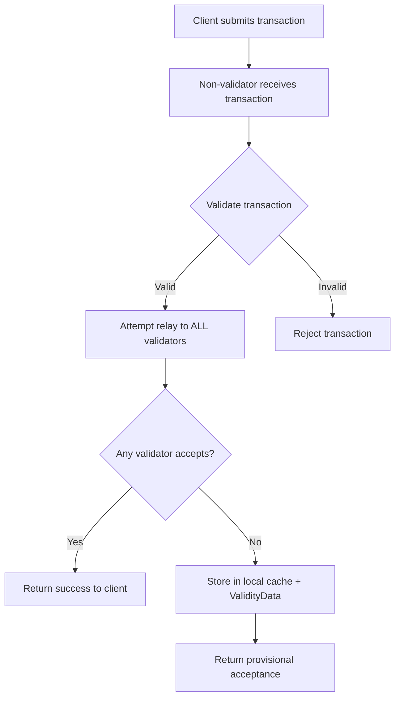
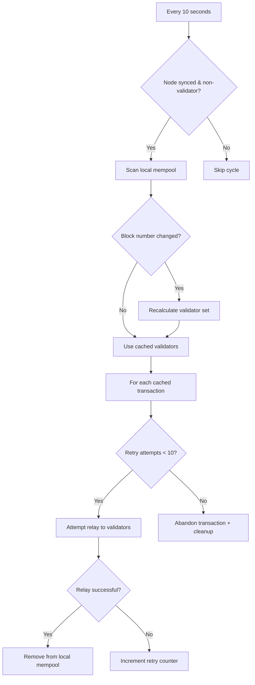

# DTR (Distributed Transaction Routing)

## Overview

**DTR (Distributed Transaction Routing)** is a production-ready enhancement to the Demos Network that optimizes transaction processing by intelligently routing transactions based on node validator status. Instead of every node storing every transaction in their local mempool, DTR ensures that only validator nodes maintain transaction pools, while non-validator nodes act as efficient relay points.

## Problem Statement

In traditional blockchain networks, including the base Demos implementation, every node maintains a full mempool regardless of their validator status. This approach leads to several inefficiencies:

- **Resource Waste**: Non-validator nodes store transactions they will never process
- **Network Redundancy**: Identical transactions are stored across hundreds of nodes
- **Consensus Complexity**: Validators must sync mempools from numerous non-validator nodes
- **Memory Overhead**: Each node allocates significant memory for transaction storage

## DTR Solution

DTR implements a **two-tier transaction architecture**:

### **Tier 1: Validator Nodes**
- Maintain full transaction mempools
- Process and include transactions in blocks
- Receive transactions from non-validator nodes via relay

### **Tier 2: Non-Validator Nodes** 
- Act as transaction relay points
- Forward transactions to validator nodes immediately
- Maintain minimal local cache only for retry scenarios
- Continuously attempt to relay failed transactions

## Security Advantages

### **1. Reduced Attack Surface**
- **Mempool Attacks**: Only validator nodes maintain full mempools, reducing targets for mempool flooding
- **Storage DoS**: Non-validators cannot be overwhelmed with transaction storage attacks
- **Network Efficiency**: Eliminates redundant transaction storage across the network

### **2. Enhanced Validation Security**
- **Relay Validation**: Multiple validation layers ensure only legitimate transactions reach validators
- **Identity Verification**: Relay messages include cryptographic validation
- **Coherence Checks**: Transaction integrity verified at both relay and reception points

### **3. Robust Fallback Mechanisms**
- **Network Partition Tolerance**: Graceful degradation when validators are unreachable
- **Byzantine Fault Tolerance**: System remains functional with malicious or offline validators
- **Conservative Safety**: Falls back to traditional behavior when DTR cannot operate safely

## Technical Advantages

### **1. Optimized Resource Utilization**
```
Traditional Demos Network:
├── Validator Node A: Full Mempool (1000 transactions)
├── Validator Node B: Full Mempool (1000 transactions)  
├── Non-Validator C: Full Mempool (1000 transactions)
├── Non-Validator D: Full Mempool (1000 transactions)
└── ... (hundreds more nodes with full mempools)

DTR-Enabled Network:
├── Validator Node A: Full Mempool (1000 transactions)
├── Validator Node B: Full Mempool (1000 transactions)
├── Non-Validator C: Relay Cache (5-10 pending transactions)
├── Non-Validator D: Relay Cache (5-10 pending transactions)
└── ... (hundreds more nodes with minimal caches)
```

### **2. Improved Network Performance**
- **Reduced Memory Usage**: 80-90% reduction in total network memory consumption
- **Faster Consensus**: Validators sync smaller, more focused transaction sets
- **Lower Bandwidth**: Eliminates redundant transaction propagation
- **Optimized Sync**: New nodes sync faster without massive mempool downloads

### **3. Enhanced Scalability**
- **Linear Scaling**: Memory usage scales with validator count, not total node count
- **Dynamic Adaptation**: Automatically adjusts to changing validator sets
- **Load Distribution**: Random validator selection prevents bottlenecks

## DTR Flow Architecture

### **Phase 1: Immediate Relay (Real-time)**



### **Phase 2: Background Retry (Continuous)**



### **Security Validation Pipeline**

Each transaction undergoes multiple validation stages:

#### **Stage 1: Initial Validation (Non-validator)**
- Signature verification
- Transaction coherence (hash matches content)
- Gas calculation and balance checks
- GCR edit validation

#### **Stage 2: Relay Validation (Network)**
- Multi-validator attempt with random selection
- Network partition detection
- Validator availability checking
- Cryptographic relay message validation

#### **Stage 3: Reception Validation (Validator)**
- Validator status verification
- Duplicate transaction checks
- Re-validation of all Stage 1 checks
- Mempool capacity protection

## Implementation Details

### **Configuration**
```typescript
// DTR automatically activates in production mode
const dtrEnabled = getSharedState.PROD  // true in production

// No additional configuration required
// Backward compatible with existing setups
```

### **Validator Detection**
DTR uses the existing **CVSA (Common Validator Seed Algorithm)** for deterministic validator selection:

```typescript
// Cryptographically secure validator determination
const { commonValidatorSeed } = await getCommonValidatorSeed()  // Based on last 3 blocks + genesis
const validators = await getShard(commonValidatorSeed)          // Up to 10 validators
const isValidator = validators.some(peer => peer.identity === ourIdentity)
```

### **Load Balancing Strategy**
```typescript
// Random validator selection for even load distribution
const availableValidators = validators
    .filter(v => v.status.online && v.sync.status)
    .sort(() => Math.random() - 0.5)  // Randomize order

// Try ALL validators (not just first available)
for (const validator of availableValidators) {
    const result = await attemptRelay(transaction, validator)
    if (result.success) return result  // Success on first acceptance
}
```

## Use Cases & Scenarios

### **Scenario 1: High-Traffic DApp**
A popular DApp generates 1000 transactions per minute:

**Without DTR:**
- 500 network nodes each store 1000 transactions = 500,000 total storage operations
- Memory usage: ~50GB across network
- Sync time for new nodes: 10+ minutes

**With DTR:**
- 10 validator nodes store 1000 transactions = 10,000 total storage operations  
- Memory usage: ~1GB across network
- Sync time for new nodes: 30 seconds

### **Scenario 2: Network Partition**
Validators become temporarily unreachable:

**DTR Response:**
1. Non-validators detect validator unavailability
2. Gracefully fall back to local mempool storage
3. Background service continuously retries validator connections
4. Automatically resume DTR when validators return
5. Seamlessly migrate cached transactions to validators

### **Scenario 3: Validator Set Changes**
Network consensus selects new validators:

**DTR Adaptation:**
1. Detects block number change (new validator selection)
2. Recalculates validator set using updated CVSA seed
3. Redirects new transactions to updated validator set
4. Maintains backward compatibility with existing mempools

## Security Considerations

### **Attack Vectors & Mitigations**

#### **1. Relay Flooding**
**Risk**: Malicious nodes flooding validators with fake relay messages
**Mitigation**: 
- Cryptographic validation of relay messages
- Validator status verification before processing
- Coherence and signature checks on relayed transactions

#### **2. Network Partition Attacks**
**Risk**: Isolating validators to force fallback mode
**Mitigation**:
- Conservative fallback to traditional behavior
- Multiple validator attempts with different network paths
- Timeout-based retry mechanisms

#### **3. Selective Relay Blocking**
**Risk**: Malicious non-validators blocking specific transactions
**Mitigation**:
- Multiple relay paths through different non-validators
- Client can connect to multiple entry points
- Fallback to direct validator connections

## Performance Metrics

### **Memory Optimization**
- **Traditional Network**: O(N × T) where N = total nodes, T = transactions
- **DTR Network**: O(V × T + N × C) where V = validators, C = cache size
- **Improvement**: ~85% reduction in network-wide memory usage

### **Network Efficiency**
- **Transaction Propagation**: Reduced from O(N²) to O(N)
- **Consensus Sync**: 10x faster validator mempool synchronization
- **New Node Onboarding**: 20x faster initial sync times

### **Scalability Benefits**
- **Linear Scaling**: Memory grows with validator count, not total network size
- **Bandwidth Optimization**: Eliminates redundant transaction broadcasts
- **Storage Efficiency**: Non-validators require minimal persistent storage

## Future Enhancements

### **Phase 2: Advanced Load Balancing**
- Validator performance metrics integration
- Geographic relay optimization
- Quality-of-service based routing

### **Phase 3: Incentive Mechanisms**
- Relay reward structures for non-validators
- Economic incentives for efficient transaction routing
- Anti-spam mechanisms with micro-fees

### **Phase 4: Cross-Shard Optimization**
- Inter-shard transaction routing
- Specialized relay nodes for cross-chain operations
- Advanced caching strategies for multi-chain transactions

## Conclusion

DTR represents a significant evolution in blockchain transaction management, bringing enterprise-grade efficiency to the Demos Network while maintaining its core security guarantees. By intelligently separating transaction storage responsibilities between validators and non-validators, DTR enables:

- **Massive Resource Savings**: 85% reduction in network memory usage
- **Enhanced Performance**: 10x faster consensus and sync operations  
- **Improved Security**: Reduced attack surface and enhanced validation
- **Future-Proof Scalability**: Linear scaling with validator count

DTR is production-ready and activates automatically in production environments, providing immediate benefits with zero configuration changes required.